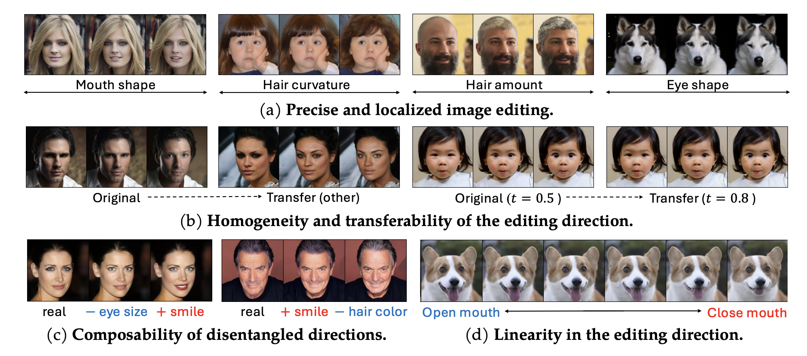
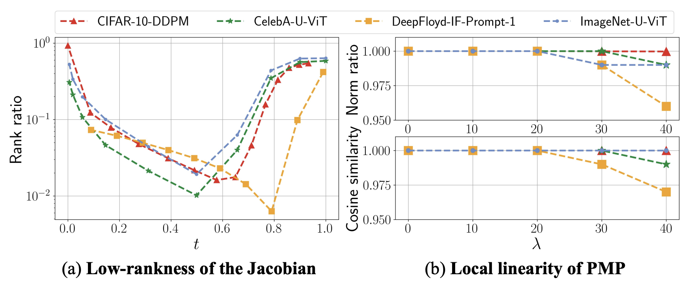
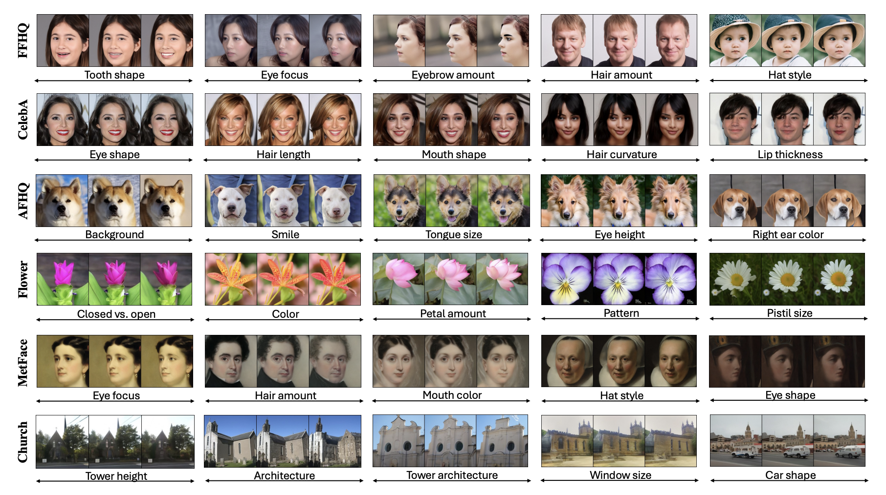
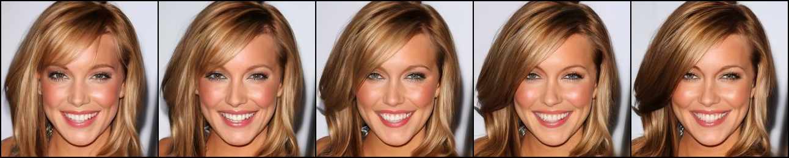
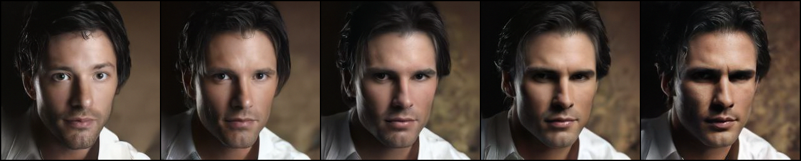
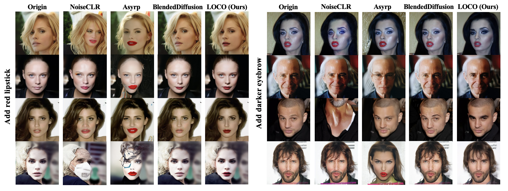
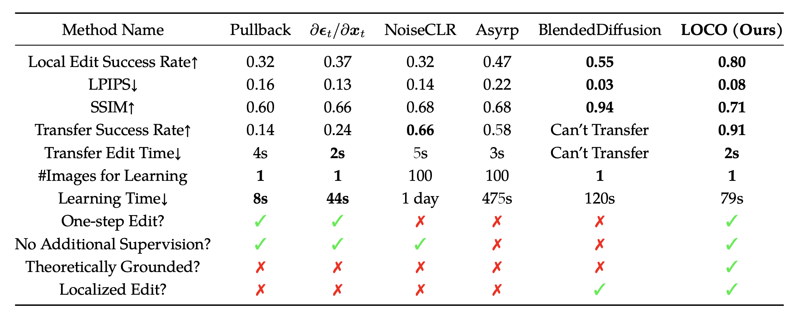
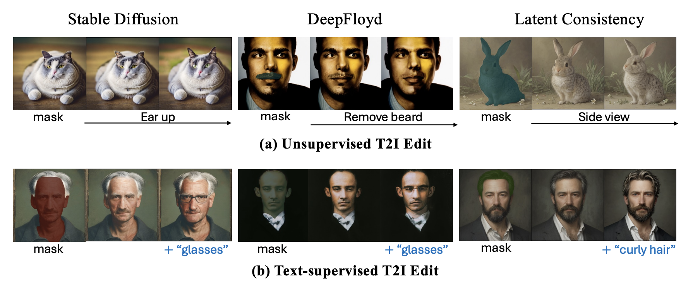

# LOCO-Edit (NeurIPS 2024)
Code for [Exploring Low-Dimensional Subspaces in Diffusion Models for Controllable Image Editing](https://chicychen.github.io/LOCO/index.html).



## Environment
```
conda create -n loco python=3.10
conda activate loco
pip install -r requirements.txt
```
We list the most important packages. You may need to install other ones (especially for using huggingface). Our experiment is conducted with ``Python 3.10.14``, ``cuda/12.1.1``, and ``cudnn/12.1-v8.9.0``.


## Low-rankness and Local Linearlity in PMP

We adapt the codes from [this repositary](https://github.com/huijieZH/Diffusion-Model-Generalizability) to compute numerical rank and local linearity in PMP.

## LOCO-Edit


### CelebAMask-HQ




- **Prepare dataset.** Download dataset from [this website](https://github.com/switchablenorms/CelebAMask-HQ) to your local server and extract. You should get a folder path in the form ``data_folder = ".../CelebAMask-HQ"``.

- **Find editing directions and conduct unsupervised editing.** Change ``--dataset_root`` to ``data_folder`` in ``src/scripts/main_celeba_hf_null_space_projection.sh``, and then run the following scripts as an example. The results should be in ``src/runs/``. We provide several examples in ``src/scripts/main_celeba_hf_null_space_projection.sh``.

```
cd src
bash scripts/main_celeba_hf_null_space_projection.sh
```

- **Transfer editing directions.** You can also transfer the editing direction from one image to another by specifying the ``--vT_path`` argument. For example, we have transferred ``.../runs/.../sample_idx4729/basis/local_basis-0.6T-select-mask-l_eye/4729-Edit_xt-noise-False_l_eye-edit_0.6T_null_proj_True_rank5_scale_0.5-pc_000-vT.pt`` to sample ``5949``. Another way to transfer or compose multiple directions is to run the ``group_edit_null_space_projection`` function.

### FFHQ, AFHQ, Flowers, Church, and Metface

- **Prepare dataset.** Download FFHQ from [here](https://www.kaggle.com/datasets/arnaud58/flickrfaceshq-dataset-ffhq?resource=download) and extract and similarly for AFHQ from [here](https://www.kaggle.com/datasets/xuzhaoliu/afhq-datasets). Change ``--dataset_root`` accordingly. For Flowers, Church, and Metface, we load dataset directly from huggingface, no ``--dataset_root`` is required. For DDPM model details, see the below scripts as examples.


- **Extract masks via SAM.** These datasets do not come with ground truth masks, so we use SAM to help. You need to first specify ``--sampling_mode`` as ``True`` to extract masks.


- **Find editing directions and conduct unsupervised editing.** After extarcting all masks, you can select a mask with ``--mask_index`` with ``--sampling_mode`` set as ``False`` to edit certain region of interest. We provide sample code in the below scripts. Note the default ``--sampling_mode`` is ``True`` for all scripts.

```
cd src
bash scripts/main_hf_null_space_projection_FFHQ_P2.sh
bash scripts/main_hf_null_space_projection_AFHQ_P2.sh
bash scripts/main_hf_null_space_projection_Flower_P2.sh
bash scripts/main_hf_null_space_projection_Metface_P2.sh
bash scripts/main_hf_null_space_projection_Church.sh
```


### Evaluation


We provide sample evaluation codes for SSIM, LPIPS, and MMSE in ``src/eval.py``. For methods in comparison with ours, please refer to their own repository.

## T-LOCO-Edit

- **Prepare dataset.** No preparation is needed, since we specify ``--seed`` to fix the initial noise for denoising. Setting ``--seed`` to ``0`` will produce a random number as seed. It is suggested that you first run by ``--sampling_mode`` as ``True`` to generate high quality images and masks. Then specify ``--seed`` and ``--mask_index`` with ``--sampling_mode`` set as ``False`` to do editing. Lastly, you may specify ``--cache_folder`` to save models in a specific local folder.

- **Find editing directions and conduct unsupervised editing.** See examples below.
```
cd src
bash scripts/main_T2I_StableDiffusion_null_space_projection_nonsemantic.sh
bash scripts/main_T2I_DeepFloydIF_null_space_projection_nonsemantic.sh
bash scripts/main_T2I_LCM_null_space_projection_nonsemantic.sh
```

- **Find editing directions and conduct text-supervised editing.** See examples below.
```
cd src
bash scripts/main_T2I_StableDiffusion_null_space_projection.sh
bash scripts/main_T2I_DeepFloydIF_null_space_projection.sh
bash scripts/main_T2I_LCM_null_space_projection.sh
```

As discussed in paper, xention to T-LOCO-Edit is not as strong as LOCO-Edit, which opens both theoretical and practical directions for future exploration.

## BibTeX
```
@inproceedings{
    chen2024exploringlowdimensionalsubspacesdiffusion,
    title={Exploring Low-Dimensional Subspace in Diffusion Models for Controllable Image Editing},
    author={Siyi Chen and Huijie Zhang and Minzhe Guo and Yifu Lu and Peng Wang and Qing Qu},
    booktitle={The Thirty-eighth Annual Conference on Neural Information Processing Systems},
    year={2024},
    url={https://arxiv.org/abs/2409.02374}
    }
```

